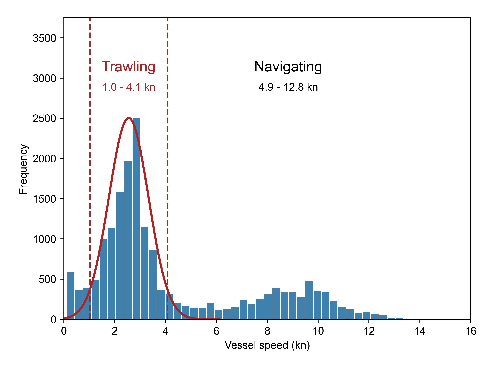
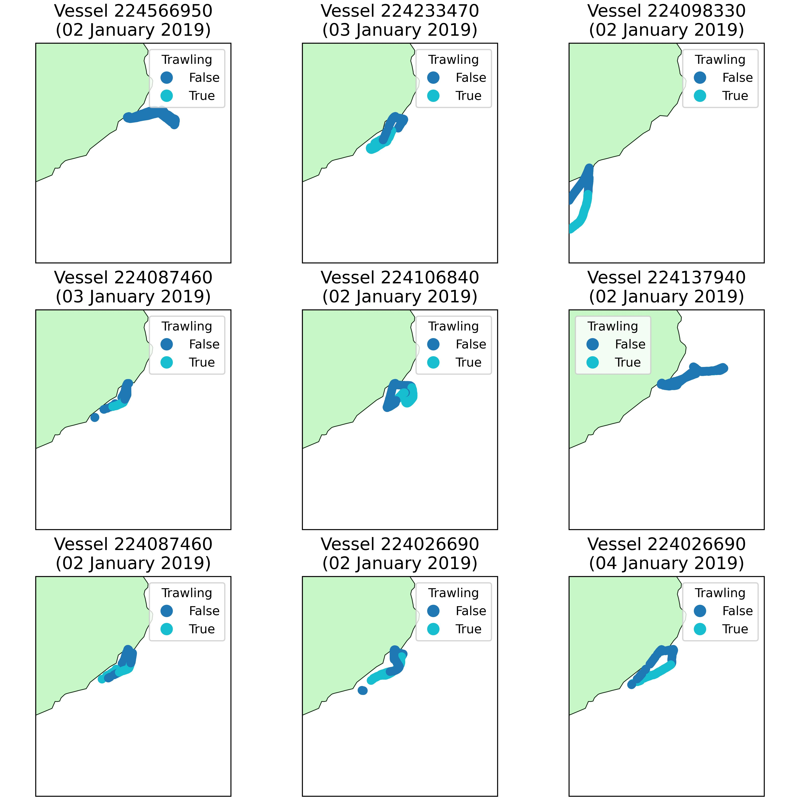

# fishingeffort

Estimate and analyze fishing effort of demersal mobile fishing gears (e.g., bottom trawlers) from global positioning 
systems (GPS) such as AIS and VMS data.
<br/>Calculates vessel tracks, independent fishing hauls, and fishing effort in swept area ratio (SAR). 
<br/>Additional functions are available to visualize the output (raw datapoints, hauls, or SAR).


## Installation

You can install fishingeffort using pip:

```bash
pip install fishingeffort
```

### Requirements
Currently, *fishingeffort* has the following dependencies:
* *pandas*
* *numpy*
* *geopandas*
* *geocube*
* *scipy*
* *cartopy*
* *rasterio*
* *seaborn*

## Usage

A full description of the application and validation of this package will be provided in a peer-reviewed manuscript, currently under preparation.


Since this package relies on geographical data, knowledge on how to handle geographical data and different projections, is highly benefitial.

### 1. Read data and clean up

To be able to quantify fishing effort, the data needs to ***at least*** have columns that relate to **date and time**) 
(e.g., 2025-01-25 12:57:01), **vessel identifier** or unique vessel name (there can not be two different vessels with the same name), 
**coordinates** latitude and longitude in decimal degrees (e.g., 41.015, 3.007), **vessel speed** in a consistent unit (knots, km/h, miles/h). 


Although optional, to properly quantify fishing effort, it is important to have additional information about the fishing fleet.
For instance, what is the *width* of the fishing gear in contact with the seafloor? This metric is used to properly quantify the 
swept area ratio (SAR). 


Also, you will have to validate the identification of hauls, so a general knowledge of the fishing grounds is important 
(if the algorithm identifies that fishing is happening in a extremely rocky bottom, you know that the trawlers are definitely not fishing there).
In these situations, the inputted parameters such as *minimum haul time*, *mininum duration of false negatives* or 
*maximum duration of false positives* (see next section for more detail).

```python
import fishingeffort.fishingeffort as fe

# The package currently supports reading data stored in .csv, .xls, or .xlsx files.
# If the file is not in the working directory, you can specify in which directory to find it.

df_csv = fe.read_df(file_dir='C:/Your/file/directory',
                    file='your_file.csv')

df_xlsx = fe.read_df(file_dir='C:/Your/file/directory',
                     file='your_file.xlsx')
```

If the frequency of data is too high (every few seconds), it will be very computationally intensive to run the algorithm.
In those situations, we recommend to reduce the frequency to once every minute 
[(Paradis et al., 2021)](https://agupubs.onlinelibrary.wiley.com/doi/full/10.1029/2020GL091279). 


The package *fishingeffort* has a function that does this.

````python
import fishingeffort.fishingeffort as fe

# Function that extracts the first entry of each minute for each vessel to make the algorithm less computationally intensive

new_df = fe.data_reduction_min(df=df,  # DataFrame with the data
                               datetime_column='Date',  # Column with date and time. It will be converted to datetime format.
                               name_column='Vessel_Id',  # Column with unique vessel identifier
                               additional_columns=['latitude', 'longitude',  # List of additional columns to be retained
                                                   'vessel_speed', 'fishing_gear', 'LoA']
                               )
````


### 2. Define fishing speed

The first step in the quantification of fishing effort is the identification of bottom trawler. 
As observed by [Natale et al. (2015)](https://journals.plos.org/plosone/article?id=10.1371/journal.pone.0130746), 
[Oberle et al. (2016)](https://www.sciencedirect.com/science/article/pii/S0924796315002328?casa_token=ShbM9hds8ucAAAAA:hE1GE6Cxg72XdBJ5H4vhJAaUJqHEp-KsGavVLrYLZ3I9YqhvzeWBoXVt8AuwVFhopQt6qsMyBZU), 
and [Paradis et al. (2021)](https://agupubs.onlinelibrary.wiley.com/doi/full/10.1029/2020GL091279), 
bottom trawlers' speed follow a bimodal distribution corresponding to fishing (first gaussian distribution, low speed)
and navigating (second gaussian distribution, high speed). In some exceptions, the speed distribution can present a 
trimodal distribution, associated to the drifting of vessels by strong currents [(Arjona-Camas et al., 2022)]().


The range of fishing speed is extracted by fitting either a bimodal or trimodal gaussian distribution of the dataset.

```python
import fishingeffort.fishingeffort as fe

# Identify fishing and navigation speed by fitting a bimodal gaussian distribution (default) to the dataset
speed_parameters = fe.define_fishing_speed(df=df,  # DataFrame with all the data
                                           speed_column='vessel_speed',  # Column name of vessel speed 
                                           mean_trawl=2,  # Estimated mean fishing speed
                                           mean_nav=10  # Estimated mean navigating speed
                                           )

# If the data has a trimodal distribution
speed_parameters = fe.define_fishing_speed(df=df, 
                                           speed_column='vessel_speed', 
                                           modal='trimodal',  # If data has a trimodal distribution, it is defined here
                                           mean_drift=0.5,  # If a trimodal distribution needs to be fitted, provide mean speed of the first distribution
                                           mean_trawl=2, 
                                           mean_nav=10)

# In the case of a bi-modal distribution, it returns a DataFrame like this
+------------+---------+-----------+---------------+---------------+
|            |    mean |   std_dev |   range_lower |   range_upper |
+============+=========+===========+===============+===============
| trawl      | 2.54851 |  0.780046 |       1.01962 |        4.0774 |
+------------+---------+-----------+---------------+---------------+
| navigating | 8.82649 |  2.02624  |       4.85507 |       12.7979 |
+------------+---------+-----------+---------------+---------------+
```

The package *fishingeffort* also has a helper functions to easily visualize different outputs.


For example, you can visualize the identification of fishing speed using the *draw_histogram* function in the *show* module as such:

```python
import fishingeffort.show as fe_show

fe_show.draw_histogram(data=df['vessel_speed'],  # Data Series with vessel speed
                       df_speed_params=speed_parameters,  # Output DataFrame of the define_fishing_speed function
                       fig_name='speed_hist',   # Name that the figure will be stored as (optional)
                       format_fig='jpg'  # Format of the figure to be stored in
                       )
```


### 3. Identify demersal fishing activity based on fishing speed

Simply filtering datapoints based on speed can lead to ***false-positives***, when fishing vessels are moving at 
fishing speeds, but they are actually not fishing (e.g., pulling up the net while drifting at the same fishing speed), 
or ***false-negatives*** when vessels are fishing at anomalous speeds for a few minutes due to specific conditions 
(e.g., trawlers reduce their speed when fishing downslope in order to keep the gear on the seafloor).

To account for this, a tolerance of the maximum duration of false-positives and false-negatives is set:
* If the vessel presents consecutive fishing speeds that ***last less than the maximum duration of false-positives***, 
it is considered that the vessel was not fishing and the vessel was moving at fishing speed while not fishing
(it was a false-positive). 
* If the vessel presents consecutive fishing speeds that ***last less than the maximum duration of false-negatives***, 
and this occurs before and after the vessel is actually moving at fishing speeds 
(the vessel is moving at fishing speeds and for a short period of time it stops moving a fishing speed), 
it is considered that the vessel is actually fishing at these anomalous speeds (it was a false-negative).

After accounting for false-positives and false-negatives, the identification of a fishing trip, or a fishing haul, 
is determined when a vessel has consecutive entries at fishing speeds for a minimum duration (*min_haul*). For example, 
many bottom trawlers maintain their nets on the seafloor for at least one hour. Hence, a vessel needs to have 
consecutive entries that last at least one hour for it to be considered a haul.

Finally, vessel positioning may be missing for a specific time, but this does not necessarily imply that the haul has ended.
This is accounted for by establishing a tolerance time (*turn_off_time*) where this gap of data is simply ignored. 
For instance, there may be a gap of data that lasts 30 mins, but it should not be considered as the end of a haul.

Hauls are automatically separated based on day (the same haul can not occur in two different days) and vessel 
(consecutive entries are assessed for each vessel independently).

This leads to four important parameters:
* min_haul = Minimum haul duration in minutes
* max_duration_false_positive = Maximum duration in minutes that a vessel is *not* fishing but still moving at fishing speed
* max_duration_false_negative = Maximum duration in minutes that a vessel is fishing but not at the specified fishing speed.
* turn_off_time = Maximum time in minutes where a gap of data is ignored.

```python
import fishingeffort.fishingeffort as fe

# Function that identifies if a vessel if fishing based on the criteria described above.

df_out, cnt = fe.identify_fishing(df=df,  # DataFrame with the data
                                  datetime_column='Date',  # Column with date and time. It will be converted to datetime format.
                                  name_column='Vessel_Id',  # Column with unique vessel identifier.
                                  speed_column='vessel_speed',  # Column with vessel speed.
                                  min_trawl_speed=1.02,  # Minimum fishing speed, as defined from the previous criteria
                                  max_trawl_speed=4.08,  # Maximum fishing speed, as defined from the previous criteria
                                  min_nav_speed=4.86,  # Minimum navigating speed, as defined from the previous criteria
                                  max_duration_false_positive=15,  # Maximum duration (mins) before the data is considered to be false-positive
                                  max_duration_false_negative=5,  # Maximum duration (mins) before the data is considered to be false-negative
                                  min_haul=60,  # Minimum duration (mins) of a fishing haul
                                  turn_off_time=30,  # Maximum time (mins) where a gap of data is ignored
                                  remove_no_hauls=False,  # Boolean to determine whether the output DataFrame should remove entries that are
                                  # not considered fishing (True) or if these entries should be kept (False)
                                  date_format="%d-%m-%y %H:$M"  # Date-time format. See datetime.strftime() codes
                                  )

# This function returns a DataFrame (df) with an additional column "Haul id" which is an identifier of all the unique hauls 
# detected in this dataset, as well as the total number of hauls detected (cnt).
```

Determining these parameters is crucial to properly identify fishing effort. 
General knowledge of the fishing activity is important to determine if these four parameters are correct. 
Luckily, the package *fishingeffort* also has helper functions to easily visualize the output.

```python
import fishingeffort.show as fe_show

# Function that iteratively plots vessel positioning, randomly choosing a vessel and day.
fe_show.fishing_identification_check(df=df_out,  # Output DataFrame of identify_fishing() function  
                                     name_column='Vessel_Id',  # Column with unique vessel identifier.
                                     datetime_column='Date',  # Column with date and time. It will be converted to datetime format.
                                     latitude='lat',  # Column with latitude
                                     longitude='lon',  # Column with longitude
                                     input_crs='epsg:4326',  # Input coordinate system of coordinates. Defaults to WGS 84.
                                     n_fig=9,  # Number of subplots to generate.
                                     fig_name='parameter_evaluation',  # Name of output figure and figure format.
                                     format_fig='jpg'
                                     )
```


Note that for Vessel 224087460 on January 2 and on January 3, consecutive entries of *True* trawling 
events are interrupted by *False* trawling events.
Since trawlers seldomly stop fishing for such a short period, this most probably indicates that it's a ***false-negative***, 
the vessel was actually fishing but it was classified as non-fishing.
In addition, no fishing trips were identified for Vessel 224566950 on January 2 and for Vessel 224137940 on January 2, 
which probably indicates that the parameters are too strict (e.g., minimum haul is too long).

### 4. Convert point data (geographical positioning) to line data (fishing hauls)

After identifying the vessel positions when fishing is occurring, the data can be transformed into line data by 
connecting the points of the same fishing trip (*Haul id*) identified during the previous step.

This function requires the following parameters:
- df = DataFrame with "Haul id" as a column. It should be the output of the previous function *identify_fishing*
- name_column = Column name of the unique vessel identifier
- latitude = Column name with latitude in decimal degrees (WGS84)
- longitude = Column name with longitude in decimal degrees (WGS84)
- output_crs (optional) = epsg code of the output coordinate reference system, ideally a UTM projection so that the units are in meters (needed to identify fishing effort, next step).
If left blank, it will return a GeoDataFrame in WGS84 coordinate system.
```python
import fishingeffort.fishingeffort as fe

df_hauls = fe.point_to_line(df=df,
                            name_column='Vessel_Id',
                            latitude='latitude', longitude='longitude',
                            output_crs='epsg: 32631')

# If you don't know the UTM zone, it can also be extracted using the following additional function
utm_zone = fe.utm_zone_epsg(df=df, latitude='latitude', longitude='longitude')

# And add it to the previous function
df_hauls = fe.point_to_line(df=df, 
                            name_column='Vessel_Id',
                            latitude='latitude', longitude='longitude',
                            output_crs=utm_zone)
```

### 5. Calculate fishing effort as swept area ratio (SAR)

If you want to convert the hauls (line data) into swept area ratio (raster), this can be done with the *swept_area_ratio* function.

This function requires as an input a GeoDataFrame with *lines* as geometries, such as the output of the *point_to_line* function.
</br>You also need to specify the grid size (the width or height of each grid cell). The units are the same as the input 
Coordinate Reference System, which is why we recommend users to convert to UTM (meters). 
Ideally, you should provide the gear width,
since this is needed to calculate the estimated area impacted by the fishing gear. 
</br>You can optionally also specify the bounds, or outer limits, of the raster if you want to ensure that the raster cells are 
always positioned in the same location, or to ensure that the raster is aligned to another raster. 
</br>The data is then saved in a raster as a GeoTiff (.tif).

```python
import fishingeffort.fishingeffort as fe

fe.swept_area_ratio(grid_size=100, # Since the input Coordinate Reference System is in UTM (meters), 
                    # then the units of the grid size are also in meters. In this case, the output grid size is in 100 x 100 m
                    gdf=df_hauls, # GeoDataFrame of hauls in lines
                    file_name=f'SAR.tif', # Output file name, in .tif
                    gear_width=100, # Width of trawling gear, in the same units of the CRS, in this case meters
                    dir_out='output' # Like the other function, you can specify in which directory to save the data in 
                    )
```

### Additional functions
To facilitate handling of data, there are several additional functions in this package. 

Since data of vessel positioning (GPS points) and hauls (lines) can be quite large, the package has a series of 
functions to save the data.

```python
import fishingeffort.fishingeffort as fe

# If you want to save all the data in a specified format (.csv, .shp, .xlsx, or .xls)
fe.save_all_data(df=df,
                 file_name='VMS_positions',
                 output_type='csv',
                 dir_output='C:/My/Folder'  # Specify which directory to save the data to, if different than the working directory
                 )

# You can also save your files into a shapefile. 
# If the input DataFrame is not a GeoDataFrame, it will be created before saving it as a shapefile. 
# In those situations, the columns for latitude and longitude, as well as the coordinate system, need to be specified 
# if it is a DataFrame. If it is a GeoDataFrame, it will automatically save with its own geometry.
fe.save_all_data(df=df,
                 file_name='VMS_positions',
                 output_type='.shp',
                 latitude='Lat', longitude='Lon',  # Column names of latitude and longitude
                 input_crs='epsg:4326'  # Coordinate system EPSG code (e.g., WGS84)
                 )

# If you have a lot of data, it can also be separated and saved based on year or month
fe.save_all_data_months(df=df_hauls, 
                        datetime_column='Date',
                        dir_output='C:/My/Folder/Monthly_data',  # Since the data is not saved in one file, but is 
                        # instead separated into smaller files per month, if an output directory is not specified, 
                        # all the individual files will be saved in the current working directory. 
                        # The output name of each individual file will be the year and month of the data (e.g., 2019_02.csv)
                        output_type='.csv')

fe.save_all_data_years(df=df_hauls, 
                       datetime_column='Date',
                       dir_output='C:/My/Folder/Monthly_data',  # Since the data is not saved in one file, but is 
                       # instead separated into smaller files per year, if an output directory is not specified, 
                       # all the individual files will be saved in the current working directory. 
                       # The output name of each individual file will be the year of the data (e.g., 2019.csv)
                       output_type='.csv')

```

Likewise, there are functions that reads all the files in one directory and combines them all in one DataFrame.
This function assumes that all the data to be opened in the directory is saved in the same format (they are all .csv, .xlsx, or .shp)
and that they have the same columns, to be able to easily concatenate them.

```python
import fishingeffort.fishingeffort as fe

df = fe.read_all_data(file_dir='C:/My/Folder/Monthly_data',
                      file_type='.csv')
```

There is a function that quickly filters out data based on speed or based on fishing gear.
These functions are simple and are aimed to simplify the task of someone that is not familiar with Python and Pandas.
```python
import fishingeffort.fishingeffort as fe

df = fe.filter_speeds(df=df,
                      speed_column='vessel_speed',  # Column name where the vessel speed is stored
                      min_speed=0, max_speed=20  # Default minimum and maximum speed (in knots)
                      )

df = fe.filter_trawlers(df=df,
                        column_gear='Gear_type',  # Column name where the gear type is stored
                        gear_name='OTB'  # Name of the gear type to filter
                        )
```


## About us

**Author:** Sarah Paradis
<br>
**Cite us:** Proper citation of this package will be coming soon.

## Release History
* 0.1.0 August 2025
  * New release of *fishingeffort*

## License

This project is licensed under the MIT License - see the [LICENSE](LICENSE) file for details.

## Contributing

Contributions are welcome! 
<br>
Please open issues or pull requests on [GitHub](https://github.com/sarah-paradis/fishingeffort/).
<br>
Send an [email](mailto:sparadis@ethz.ch) with questions or any other bugs you encounter.
<br>
